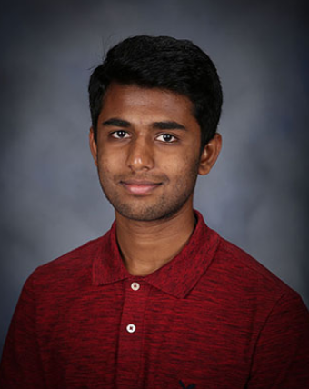

[Link to Image](images/Dhanush_Image.png)

Welcome to my personal website! I'm a 2nd year Computer Science major and Cognitive Science student at UC San Diego. My current interests include **cybersecurity** and **machine learning**. I enjoy contributing to the community through any work I do, whether that be student organizations, research, or personal projects. Check out my [Github](https://github.com/dnanjunda) to see some of the projects that I have worked on.

My favorite quote is
> The moment you give up is the moment you let someone else win.

[Education](https://github.com/dnanjunda/dnanjunda.github.io#education)

[Technical Skills](https://github.com/dnanjunda/dnanjunda.github.io#technical-skills)

## Education
#### University of California, San Diego
#### B.S., Computer Science
#### Minor in Cognitive Science

*September 2019-June 2022*

- Provost Honors every quarter
- Relevant Coursework
  - [x] Advanced Data Structures
  - [x] Software Tools and Techniques Lab
  - [x] Theory of Computability
  - [x] Computer Organization and Systems Programming
  - [x] ~~Linear Algebra~~
  - [x] ~~Statistical Methods~~
  - [ ] Intro to Machine Learning
  - [ ] Software Engineering
  
#### Amador Valley High School
#### High School Diploma

*September 2015-May 2019*

1. National AP Scholar

## Technical Skills

- macOS, Windows, Linux
- MongoDB
- Firebase
- Selenium
- Git, GitHub
- Bash
- Java, C, C++, Python, Javascript, Kotlin
- ReactJS
- HTML, CSS

The theme of this website is saved in the Jekyll `_config.yml` configuration file. Use `git clone` to get this repository on your local machine.
